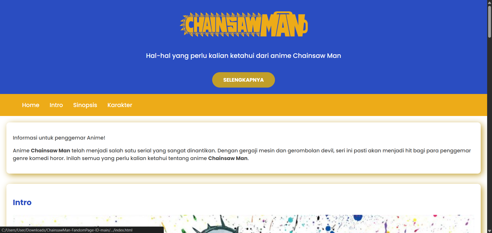

# Chainsaw Man Fandom Page

Website statis single-page bertema fandom anime **Chainsaw Man**, dibuat sebagai submission Tugas Akhir pada kelas [Belajar Dasar Pemrograman Web](https://www.dicoding.com/academies/123) — Dicoding. Submission ini mendapat rating **4/5**.

**Demo:** [Chainsaw Man Fandom Page](https://chainsawman-fandompage.netlify.app/)



## Fokus Teknis

Proyek ini merupakan latihan penerapan fondasi HTML & CSS murni (tanpa framework/library CSS), dengan penekanan pada:

- **Semantic HTML5** — struktur halaman disusun menggunakan elemen `<header>`, `<nav>`, `<main>`, `<article>`, `<aside>`, dan `<footer>` sesuai fungsinya masing-masing, bukan sekadar `<div>` bertumpuk.
- **CSS Layout dengan Flexbox** — seluruh penataan layout (termasuk grid dua kolom antara konten utama dan sidebar profil) menggunakan `display: flex`, tanpa `float`.
- **Responsive Design** — layout menyesuaikan menjadi satu kolom pada breakpoint `1200px` dan navigasi menyesuaikan pada `768px` melalui media query.
- **Sticky Navigation** — navbar tetap terlihat saat halaman di-scroll menggunakan `position: sticky`.

## Tech Stack

- HTML5
- CSS3 (custom, tanpa framework)
- Font Awesome 5 (ikon, via CDN)
- Google Fonts — Poppins & Quicksand

## Struktur Proyek

```
chainsaw-man-fandom-page/
├── index.html
├── style.css
└── img/
    ├── logo.png
    ├── icon.webp
    ├── intro.jpg
    ├── sinopsis.jpg
    ├── mainchar.avif
    ├── poster.jpg
    └── web.png
```

## Bagian Halaman

| Elemen | Isi |
|---|---|
| Header | Logo, tagline, tombol CTA, dan navigasi |
| Intro | Penjelasan singkat asal-usul serial |
| Sinopsis | Ringkasan cerita utama |
| Karakter | Tabel daftar karakter beserta deskripsinya |
| Aside | Kartu profil berisi poster dan info (genre, studio, jumlah episode, durasi) |
| Footer | Copyright dengan tahun otomatis (JavaScript inline) |

## Menjalankan Proyek

Tidak memerlukan instalasi atau build tool apa pun, cukup buka file `index.html` langsung di browser, atau gunakan live server:

```bash
# Contoh menggunakan ekstensi Live Server di VS Code,
# atau serve sederhana dengan npx:
npx serve .
```

## Catatan

Proyek ini adalah latihan front-end fundamental (HTML & CSS semantik + layout Flexbox) sebelum masuk ke materi JavaScript dan framework front-end lanjutan.
